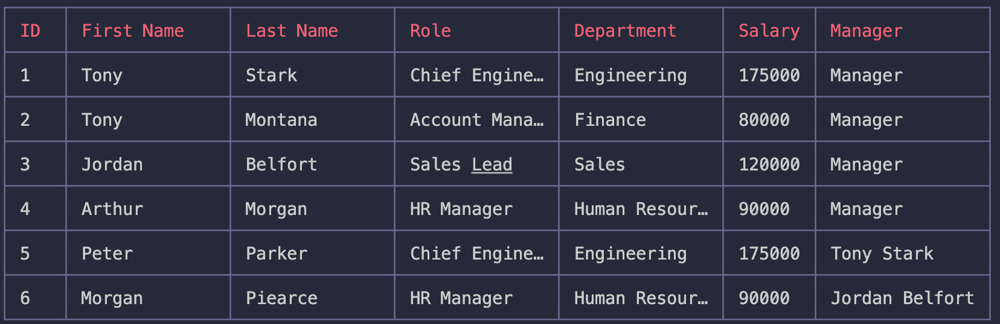
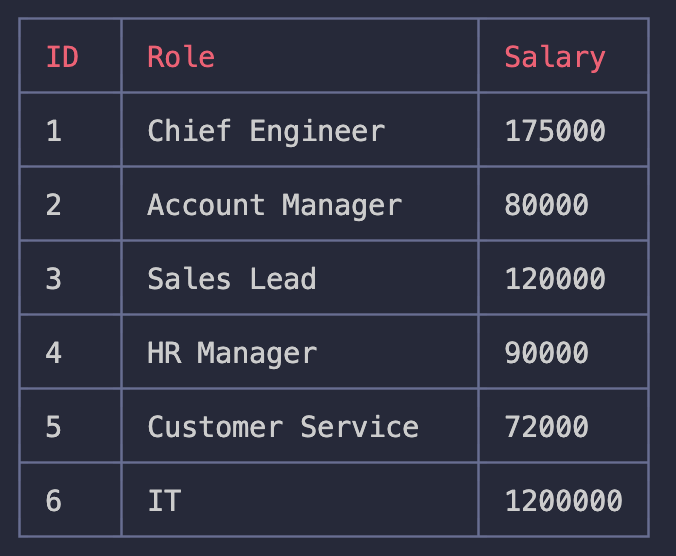
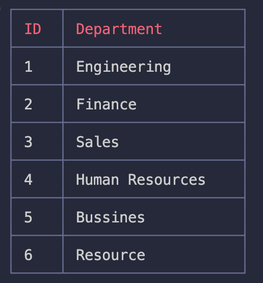

 # SQL:Employee Tracker

## Description

Employee Tracker App

CLI application, In this application you can , acces to database and make changes and you see it visualy.

## Table of Contents (Optional)

If your README is long, add a table of contents to make it easy for users to find what they need.

- [Installation](#installation)
- [Usage](#usage)
- [Credits](#credits)
- [License](#license)

## Installation

-Clone repo to your local machine
-run npm i to install all npm modules
-open terminal
-Type node server , to start application

## Usage

 You can view the employees,all roles , and all departments check down below

For video instructions

## License

## Badges

